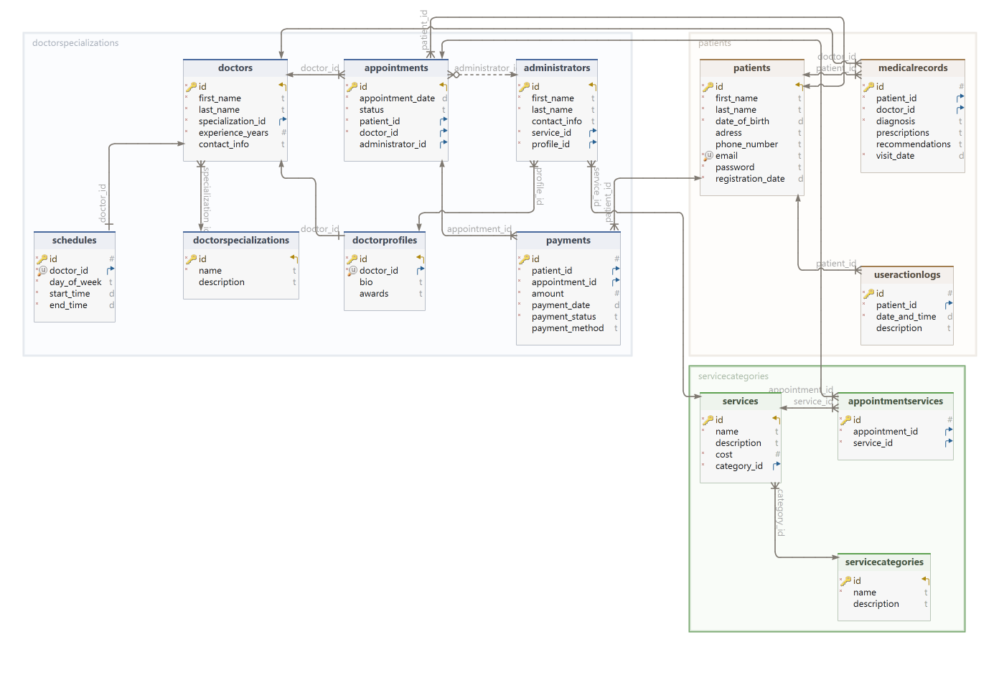

# Тема: Платная поликлиника
ФИО: Царук Вадим Александрович  
Номер группы: 253503  
## Функциональные требования
### Пользователь может:  
   - Зарегистрировать аккаунт.  
   - Войти в аккаунт с помощью своиж учетных данных(Email и пароль).
   - Записатья на прием к врачу, выбрав доступное время.
   - Отменить или изменить записи.
   - Просматривать список предоставляемых услуг и их стоимость.
   - Оплатить услугу онлайн через систему.
   - Хранить истории платежей и квитанций.
   - Обновить информацию о своем профиле (например, имя, фамилия, пароль).
   - Просматривать свой профиль и историю действий.
### Врач может:
   - Вести медицинскую карту пациента, которая хранит историю приемов, диагнозы, результаты анализов и назначения.
   - Просматривать своё расписание и информацию о пациентах.
### Администратор может:
   - Добавлять/редактировать список медицинских услуг и их стоимость.
   - Получать отчеты по числу пациентов, проведенным услугам, доходам и т.д.
   - Управлять информацией о врачах и медицинском персонале.
## Описание сущностей ДБ
**Таблица "Пациент"(Patient)**
- id(SERIAL, PK) - связь один ко многим с Appointmet, связь один ко многим с Payment, связь один ко многим с MedicalRecord, связь один ко многим с UserActionLog
- first_name(VARCHAR(255), NOT NULL)
- last_name(VARCHAR(255), NOT NULL)
- date_of_birth(DATE, NOT NULL)
- adress(VARCHAR(255))
- phone_number(VARCHAR(20))
- email(VARCHAR(100), UNIQUE NOT NULL)
- password(VARCHAR(100), NOT NULL)
- registration_date(DATE, NOT NULL, DEFAULT CURRENT_DATE)

**Таблица "Врач"(Doctor)**
- id(SERIAL, PK) - связь один ко многим с Appointment, связь один ко многим с MedicalRecord, связь один к одному с DoctorProfile, связь один к одному с Schedule
- first_name(VARCHAR(255), NOT NULL)
- last_name(VARCHAR(255), NOT NULL)
- specialization_id(INT, FK, NOT NULL) - связь многие к одному с DoctorSpezialization
- experience_years(INT, NOT NULL)
- contact_info(VARCHAR(255))

**Таблица "Услуга"(Service)**  
- id(SERIAL, PK) - связь многие ко многим с Appointment через таблицу AppointmentService, связь многие к одному с Service
- name(VARCHAR(255), NOT NULL)
- description(TEXT)
- cost(DECIMAL(10,2), NOT NULL)
- category_id(INT, FK, NOT NULL) - связь многие к одному с ServiceCategory

**Таблица "Запись на прием"(Appointment)**  
- id(SERIAL, PK) - связь один ко многим с Payment, связь многие ко многим с Service через таблицу AppoinmentService
- appointment_date(TIMESTAMP, NOT NULL)
- status(VARCHAR(50), NOT NULL)
- patient_id(INT, FK, NOT NULL) - связь многие к одному с Patient
- doctor_id(INT, FK, NOT NULL) - связь многие к одному с Doctor
- administrator_id(INT, FK) - связь многие к одному с Administrator

**Таблица "Медицинская карта"(MedicalRecord)**  
- id(SERIAL, PK)
- patient_id(INT, FK, NOT NULL) - связь многие к одному с Patient
- doctor_id(INT, FK, NOT NULL) - связь многие к одному с Doctor
- diagnosis(TEXT, NOT NULL)
- prescriptions(TEXT)
- recommendations(TEXT)
- visit_date(TIMESTAMP, NOT NULL, DEFAULT CURRENT_TIMESTAMP)

**Таблица "Платеж"(Payment)**  
- id(SERIAL, PK)
- patient_id(INT, FK, NOT NULL) - связь многие к одному с Patient
- appointment_id(INT, FK, NOT NULL) - связь многие к одному с Appointment
- amount(decimal(10,2), NOT NULL)
- payment_date(TIMESTAMP, NOT NULL, DEFAULT CURRENT_TIMESTAMP)
- payment_status(VARCHAR(50), NOT NULL)
- payment_method(VARCHAR(50))

**Таблица "Администратор"(Administrator)**  
- id(SERIAL, PK) - связь один ко мноним с Appointment
- first_name(VARCHAR(255), NOT NULL)
- last_name(VARCHAR(255), NOT NULL)
- contact_info(VARCHAR(255))
- service_id(INT, FK, NOT NULL) - связь один ко многим с Service
- profile_id(INT, FK, NOT NULL) - связь один ко многим с DoctorProfile

**Таблица "Категория услуги"(ServiceCategory)**  
- id(SERIAL, PK) - связь один ко многим с Service
- name(VARCHAR(255), NOT NULL)
- description(TEXT)

**Таблица "Специализация врача"(DoctorSpecialization)**  
- id(SERIAL, PK) - связь один ко многим с Doctor
- name(VARCHAR(255), NOT NULL)
- description(TEXT)

**Таблица "Профиль врача"(DoctorProfile)**  
- id(SERIAL, PK) - связь многие к одному с Administrator
- doctor_id(INT, FK, UNIQE NOT NULL) - связь один к одному с Doctor
- bio(TEXT)
- awards(TEXT)

**Таблица "График работы"(Schedule)**  
- id(SERIAL, PK)
- doctor_id(INT, FK, UNIQE NOT NULL) - связь один к одному с Doctor
- day_of_week(VARCHAR(50), NOT NULL)
- start_time(TIME, NOT NULL)
- end_time(TIME, NOT NULL)

**Таблица AppointmentService**  
- id(SERIAL, PK)
- appointment_id(INT, FK, NOT NULL) - связь многие к одному с Appointment
- service_id(INT, FK, NOT NULL) - связь многие к одному с Service

**Таблица "Журнал действия пользователя"(UserActionLog)**  
- id(SERIAL, PK)
- patient_id(INT, FK, NOT NULL) - связь многие к одному с Patient
- date_and_time(TIMESTAMP, NOT NULL, DEFAULT CURRENT_TIMESTAMP)
- description(VARCHAR(255))

## Схема БД

